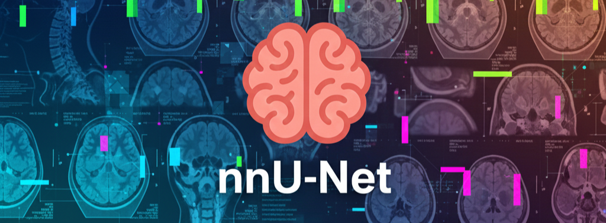
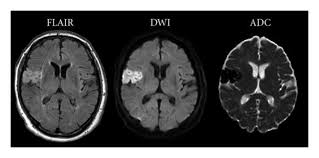

<p align="center">
  
</p>

<h1 align="center">StrokeSegNet</h1>

<p align="center">
  <b>Automated Acute Ischemic Stroke Lesion Segmentation using Diffusion MRI</b><br>
  <i>DWI + ADC | nnU-Net v2 | ISLES-2022</i>
</p>

<p align="center">
  
  
  
  
</p>

---

## 🧠 Tagline

> **“Less noise, more signal — why fewer MRI modalities can outperform more.”**

---

## 📌 Table of Contents
- [Overview](#overview)
- [Clinical Motivation](#clinical-motivation)
- [Dataset](#dataset)
- [MRI Modalities Explained](#mri-modalities-explained)
- [Methodology](#methodology)
- [Architecture](#architecture)
- [Experiments](#experiments)
- [Results](#results)
- [Why Bimodal Beats Trimodal](#why-bimodal-beats-trimodal)
- [Installation](#installation)
- [Usage](#usage)
- [Project Structure](#project-structure)
- [Citations](#citations)
- [Acknowledgements](#acknowledgements)

---

## 🧩 Overview

**StrokeSegNet** is a deep-learning system designed to automatically segment **acute ischemic stroke lesions** from brain MRI scans using **diffusion-based imaging**.

The project leverages:
- **DWI (Diffusion Weighted Imaging)**
- **ADC (Apparent Diffusion Coefficient)**

and evaluates whether adding **FLAIR** improves or degrades segmentation performance.

We use **nnU-Net v2**, a self-configuring medical image segmentation framework, trained and evaluated on the **ISLES-2022** multi-center dataset.

---

## 🏥 Clinical Motivation

- Stroke is a **time-critical medical emergency**
- Early lesion identification is essential for:
  - Thrombolysis
  - Mechanical thrombectomy
- Manual lesion segmentation:
  - Is slow
  - Is observer-dependent
  - Is impractical in emergency settings

👉 **Goal:** Fast, accurate, automated lesion segmentation.

---

## 📊 Dataset

**ISLES-2022 (MICCAI Challenge)**  
- 250 acute ischemic stroke cases  
- Multi-center, multi-scanner  
- Ground-truth expert annotations  

### Modalities Provided:
- DWI
- ADC
- FLAIR

---

## 🩻 MRI Modalities Explained

<p align="center">
  
</p>

| Modality | What it Shows | Role |
|--------|---------------|------|
| DWI | Restricted water diffusion | Stroke core detection |
| ADC | Confirms true diffusion restriction | Reduces false positives |
| FLAIR | Edema / tissue changes (late) | Often misaligned in acute stroke |

---

## 🧪 Methodology

- Framework: **nnU-Net v2**
- Configuration: **2D U-Net**
- Validation: **5-fold cross-validation**
- Hardware: RTX 3050 (4GB VRAM)
- Training optimizations for low VRAM:
  - Reduced workers
  - Epoch-level checkpointing
  - CUDA-enabled PyTorch

---

## 🏗 Architecture

<p align="center">
  
</p>

**5-Stage Encoder–Decoder with Skip Connections**
- Encoder: Feature extraction at increasing abstraction
- Bottleneck: Context aggregation
- Decoder: Precise spatial reconstruction
- Skip connections preserve fine-grained lesion details

---

## 🧪 Experiments

### Experiment A — **Bimodal (Proposed)**
- Input: **DWI + ADC**
- Fully aligned diffusion information

### Experiment B — **Trimodal (Baseline)**
- Input: **DWI + ADC + FLAIR**
- Introduces spatial misalignment noise

All other variables were kept identical.

---

## 📈 Results


| Metric | Bimodal (DWI+ADC) | Trimodal |
|------|------------------|---------|
| Mean Dice | **0.7564** | 0.7501 |
| Lesion-wise F1 | **0.8343** | 0.8305 |
| Recall | **0.7945** | 0.7777 |
| Median AVD (ml) | **1.39** | 1.63 |
| False Negatives | **Lower** | Higher |

---

## 🧠 Why Bimodal Beats Trimodal

- nnU-Net assumes **perfect voxel alignment**
- DWI + ADC are:
  - Acquired together
  - Diffusion-consistent
- FLAIR:
  - Often in native space
  - Captures delayed pathology
  - Introduces spatial noise

📌 **Key Insight:**  
> *More modalities ≠ better performance*

---

## ⚙️ Installation & Environment Setup

This project uses a **fully reproducible Conda environment** configured for **GPU-accelerated nnU-Net v2 training**.  
All package versions (NumPy, PyTorch, nnU-Net, and compiled dependencies) are pinned to ensure **consistent and repeatable results** across systems.

---

### 🔧 Prerequisites
- **Operating System:** Windows or Linux  
- **Package Manager:** Anaconda or Miniconda  
- **Hardware:** NVIDIA GPU (CUDA-capable)  
- **Drivers:** Updated NVIDIA driver (CUDA ≥ 12.x supported)

---

### 📦 Step 1: Clone the Repository

```bash
git clone https://github.com/AnkitHazarika/Brain-Health-Monitoring-System.git
cd Brain-Health-Monitoring-System
```

### 📦 Step 2: Create Conda Environment from YAML

The provided nnunet_gpu.yml file contains the exact working environment used in our experiments, including:

- CUDA-enabled PyTorch
- nnU-Net v2
- Binary-compatible NumPy
- Medical imaging dependencies (SimpleITK, nibabel, etc.)

Create the environment using:

```bash
conda env create -f nnunet_gpu.yml
```

Activate the environment:

```bash
conda activate nnunet-gpu
```

| ⚠️ **Important:** *Do not manually install or upgrade packages after this step, as it may break binary compatibility with nnU-Net.* |
